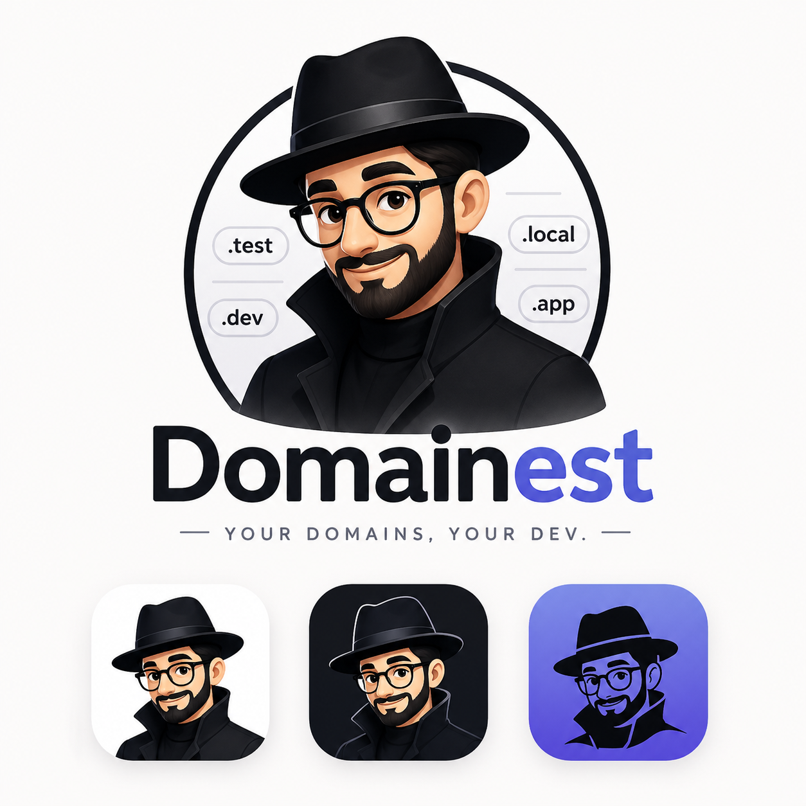

# Domainest

[](https://github.com/abdallhsamy/domainest/actions/workflows/ci.yml)
[](https://github.com/abdallhsamy/domainest/releases)
[](https://github.com/abdallhsamy/domainest)
[](https://github.com/abdallhsamy/domainest)
[](https://www.rust-lang.org/)
[](https://tauri.app/)
[](https://vuejs.org/)


Domainest is a tray/menu-bar dev tool that replaces “`pnpm dev` + localhost” with **human-friendly local domains**, e.g.:

- `https://myapp.test`
- `https://admin.test`
- `http://legacy.test` (when SSL is disabled per project)

It’s built with **Tauri (Rust)** + **Vue 3 (Vite)**, and ships a fully local stack:

- **Caddy (sidecar)**: reverse proxy + routing per domain
- **mkcert (sidecar)**: locally-trusted CA + per-domain certificates
- **Embedded DNS server**: answers `*.suffix` → `127.0.0.1` (macOS uses `/etc/resolver/<suffix>`)

## Features

- **Menu bar icon** with quick actions:
  - **Projects**, **Add Project**, **Settings**, **Quit**
  - Per-project submenu: **Start/Stop**, **Open in browser**
- **Dashboard**
  - List / add / edit / remove projects
  - Toggle SSL (mkcert) per project
  - Start/Stop + Open
  - View **live logs** for running projects
- **Correct process management**
  - Dev servers run in their own process group so **Stop terminates the full process tree**
- **Multiple projects**
  - Each project gets a **unique port** by default (3000, 3001, 3002…)
  - The dev server is started with flags/env so it **binds to the configured port**

## How it works (high level)

1. **DNS**: your chosen suffix (default `test`) resolves to `127.0.0.1`.
2. **Caddy**: routes `https://<domain>` → `http://localhost:<port>` for each running project.
3. **mkcert**: generates & reuses certs at `~/.domainest/certs/<domain>.pem`.
4. **Dev server**: Domainest spawns your configured command (default `pnpm dev`) in the project directory.

## Requirements

- **pnpm** (your projects are assumed to use it by default; you can change the command per project)
- **Rust toolchain** (for local dev of Domainest itself)

No system `caddy`, `mkcert`, or `dnsmasq` install is required: Domainest bundles what it needs.

## Install & run (development)

Install dependencies:

```bash
pnpm install
```

Optional — use the repo’s Git hooks so `cargo fmt --check` runs before each commit (matches CI; no extra npm packages):

```bash
git config core.hooksPath .githooks
```

Download bundled sidecars:

```bash
pnpm setup:deps
```

Run the app:

```bash
pnpm tauri:dev
```

## Build (production)

```bash
pnpm tauri:build
```

## CLI (headless)

Domainest ships a separate **`domainest`** binary with the same project/DNS/Caddy/mkcert behavior as the GUI (no window).

Build or run from the repo:

```bash
pnpm setup:deps   # required once (bundled caddy + mkcert)
cargo build --manifest-path src-tauri/Cargo.toml --bin domainest
./src-tauri/target/debug/domainest --help
```

Dev shortcut:

```bash
pnpm domainest -- list
pnpm domainest -- start be-brand
pnpm domainest -- zone get
```

### Commands

| Command | Description |
|---------|-------------|
| `list [--json]` | List projects |
| `add <path> [--domain] [--port] [--no-ssl]` | Add a project |
| `start <project>` | Start dev server + proxy |
| `stop <project>` | Stop dev server |
| `remove <project> -y` | Remove project |
| `open <project>` | Open URL in browser |
| `logs <project> [--bytes N] [--follow]` | Tail project log |
| `status [--json]` | Zone + project summary |
| `zone get` / `zone set <zone>` | DNS zone (e.g. `test`, `myapp.com`) |
| `dns sync` | Re-apply macOS resolvers + embedded DNS |

`<project>` is a **name**, **UUID**, or **UUID prefix**.

### GUI vs CLI

- Both use `~/.domainest/` (same `projects.json`).
- Run **only one** instance that owns Caddy admin (`127.0.0.1:2019`) — starting both GUI and CLI `start` at once can cause port conflicts.
- `dns sync` on macOS may prompt for admin (resolver files under `/etc/resolver/`).

Optional: `DOMAINEST_BIN_DIR` — directory containing `caddy-<target-triple>` and `mkcert-<target-triple>` if not next to the binary.

### CLI and DNS (important)

Each `domainest` CLI command is a **short-lived process**. When it exits, the **embedded DNS server** on `127.0.0.1:53535` stops with it. macOS resolver files under `/etc/resolver/` remain, but nothing answers on port 53535 until something starts DNS again.

| Situation | What works |
|-----------|------------|
| **Menu-bar app running** | CLI can `list`, `add`, `stop`, etc. DNS and Caddy are already up. Best mix of GUI + scripting. |
| **CLI only** (no GUI) | `start` / `dns sync` bring DNS up **for that command**, then it stops when the command finishes. Custom domains may not resolve right after unless you keep a process alive. |
| **Verify DNS** | While a command is running, or while the GUI is open: `dig +short myapp.test @127.0.0.1 -p 53535` should return `127.0.0.1`. |

**Practical workflows:**

1. **Scripting with live domains** — leave Domainest open in the menu bar, then use the CLI for `start` / `stop` / `list`.
2. **CLI-only** — run `domainest start <project>`; the dev server keeps running after the CLI exits, but for reliable `*.test` / per-project DNS you still need either the GUI running or run `domainest dns sync` before browsing (DNS only lasts while that command runs).

Caddy is started as a background child and can keep running after a CLI `start`/`stop` exits; DNS does not (v1 has no separate DNS daemon).

## Usage

### Add a project

- From the **menu bar icon**: **Add Project**
- Or from the dashboard: **Add project** → choose a folder

Default values:

- **domain**: `folder-name.<suffix>` (suffix defaults to `test`)
- **port**: first available in `3000..`
- **command/args**: `pnpm dev`
- **ssl**: enabled

### Start/Stop

- Use the project card button in the dashboard or the tray submenu.
- Stop will terminate the full `pnpm → node → watcher` tree.

### View logs (“terminal”)

- For running projects, click **Logs** on the project card.
- Logs are read from: `~/.domainest/logs/<project-id>.log`

### Change DNS zone

Open **Settings → DNS zone**.

macOS **split-DNS** only sends queries for the zone you configure to Domainest:

| Zone you set | Resolver file | What resolves locally | What stays on normal DNS |
|--------------|---------------|------------------------|---------------------------|
| `test` | `/etc/resolver/test` | `*.test` (e.g. `app.test`) | N/A (`.test` is for testing) |
| `myapp.com` | `/etc/resolver/myapp.com` | `*.myapp.com` only | `github.com`, `google.com`, etc. |

- Examples: `test`, `myapp`, `myapp.com` (with or without a leading dot)
- New projects default to `name.<zone>` (e.g. `api.myapp.com` when the zone is `myapp.com`)

**Blocked as global zone:** single-label `dev`, `com`, `app`, etc. (they hijack the whole TLD).

**Per-project `.dev` names** (e.g. `be-brand.dev` while the zone stays `test`): Domainest installs `/etc/resolver/be-brand.dev` so only that hostname uses local DNS; `github.dev` and other real `.dev` sites are unaffected.

On startup, Domainest removes stale `/etc/resolver/*` files that point at its DNS (127.0.0.1:53535) except for your active zone.

## Data locations

If you used an older build that stored data under `~/.dev-domains`, copy or move that folder to `~/.domainest` (or re-add projects in the app).

- **Projects**: `~/.domainest/projects.json`
- **App state** (mkcert installed, suffix, etc.): `~/.domainest/state.json`
- **Certificates**: `~/.domainest/certs/`
- **Logs**: `~/.domainest/logs/`
- **Caddy runtime**: `~/.domainest/caddy/`
- **Caddyfile**: `~/.domainest/Caddyfile`

## Troubleshooting

### “Only the first project works”

This usually happens when a dev server binds to a different port than expected.
Domainest now:

- assigns unique ports per project
- forces dev servers to bind to the project’s configured port

If you changed your dev command manually, ensure it honors:

- `-- --port <port>` (for Vite/Nuxt/etc)
- or `PORT=<port>` env

### Real `.dev` / `.app` sites stopped working

Usually caused by an old `/etc/resolver/dev` (or similar) from a previous suffix. Domainest now blocks those suffixes and prunes leftover resolver files on launch. You can also remove them manually:

```bash
sudo rm /etc/resolver/dev /etc/resolver/app /etc/resolver/local
sudo dscacheutil -flushcache && sudo killall -HUP mDNSResponder
```

### DNS doesn’t resolve `*.suffix`

macOS uses `/etc/resolver/<suffix>`. Verify it exists:

```bash
cat /etc/resolver/<suffix>
```

Expected content:

```text
nameserver 127.0.0.1
port 53535
```

### HTTPS certificate issues

- Certs live in `~/.domainest/certs/`
- First run performs `mkcert -install` (idempotent)

### Stale routes after crashes

Domainest rewrites the managed block in `~/.domainest/Caddyfile` and reloads Caddy on startup and project state changes.

## Project structure

- `src/`: Vue 3 dashboard + services
- `src-tauri/`: Rust backend + sidecars
  - `src-tauri/src/services/`: process manager, Caddy manager, mkcert manager, DNS server
